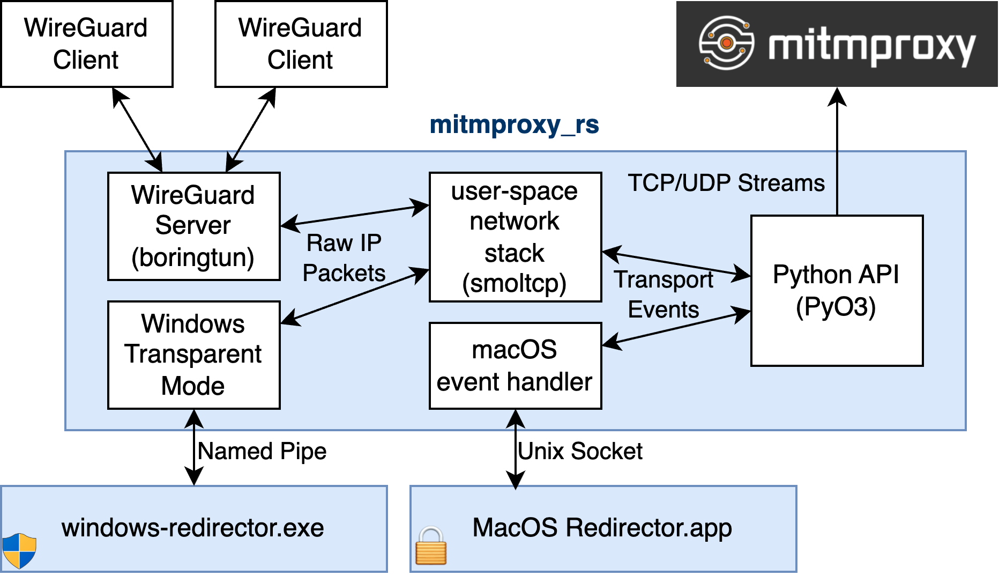

# mitmproxy_wireguard

[](https://pypi.org/project/mitmproxy-wireguard/)


[](https://github.com/decathorpe/mitmproxy_wireguard/actions/workflows/ci.yml)

Transparently proxy any device that can be configured as a WireGuard client!

## DONE

* multithreaded / asynchronous WireGuard server using tokio:
  * one worker thread for the user-space WireGuard server
  * one worker thread for the user-space network stack
  * one worker thread for communicating with the Python runtime
* full support for IPv4 packets (TCP and UDP)
* basic support for IPv6 packets (TCP and UDP)
* partial support for IPv6 packets
* Python interface similar to the Python `asyncio` module
* integration tests in mitmproxy

## TODO

* more complete IPv6 support
* various other small `TODO` and `FIXME` items

## Architecture support

`mitmproxy_wireguard` should work on most architectures / targets - including,
but not limited to Windows, macOS, and Linux, running on x86_64 (x64) and
aarch64 (arm64) CPUs.

Binary wheels for the following targets are available from PyPI:

- Windows / x64 (`x86_64-windows-msvc`)
- macOS / Intel (`x86_64-apple-darwin`)
- macos / Apple Silicon (`aarch64-apple-darwin`) via "Universal 2" binaries
- Linux / x86_64 (`x86_64-unknown-linux-gnu`)
- Linux / aarch64 (`aarch64-unknown-linux-gnu`), i.e. for Raspberry Pi 2+ and similar devices

## Requirements

`mitmproxy_wireguard` currently requires Python 3.7 or newer at runtime, since
that is the oldest version of Python that is still supported by PyO3 v0.16.
mitmproxy already requires Python 3.9 or newer, so this should not be a problem.

Additionally, `mitmproxy_wireguard` currently has the following requirements at
build-time:

- Python 3.7+ (range of Python versions that is supported by PyO3 v0.16)
- Rust 1.58.0+ (the oldest supported version of Rust / MSRV is 1.58.0)
- maturin 0.13.x

## Architecture



## Interface

The API interface of the PyO3 module is documented in `mitmproxy_wireguard.pyi`:

- `Server` class: a running WireGuard server instance, with methods for
  - graceful shutdown (`close` / `wait_closed`)
  - sending UDP packets
- `TcpStream` class: an established TCP connection (provides APIs identical to
  Python's)
  `asyncio.StreamReader` and `asyncio.StreamWriter`)
- `start_server` coroutine: initialize, start, and return a `Server` instance

## Hacking

Setting up the development environment is relatively straightforward,
as only a Rust toolchain and Python 3 are required:

```shell
# set up a new venv
python3 -m venv venv

# enter venv (use the activation script for your shell)
source ./venv/bin/activate

# install maturin and pdoc
pip install maturin pdoc
```

Compiling the native Rust module then becomes easy:

```shell
# compile native Rust module and install it in venv
maturin develop

# compile native Rust module with optimizations
maturin develop --release
```

Once that's done (phew! Rust sure does take a while to compile!), the test
echo server should work correctly. It will print instructions for connecting to
it over a WireGuard VPN:

```shell
python3 ./echo_test_server.py
```

The included `mitm-wg-test-client` binary can be used to test this echo test
server, which can be built by running `cargo build` inside the `test-client`
directory, and launched from `target/debug/mitm-wg-test-client`.

## Docs

Documentation for the Python module can be built with `pdoc`.

The documentation is built from the `mitmproxy_wireguard.pyi` type stubs and the
rustdoc documentation strings themselves. So to generate the documentation, the
native module needs to be rebuilt, as well:

```shell
maturin develop
pdoc mitmproxy_wireguard
```

By default, this will build the documentation in HTML format and serve it on
<http://localhost:8080>.

**Note**: This requires version `>=11.2.0` of pdoc. It is the first version that
supports generating documentation for "native-only" Python modules (like our
`mitmproxy_wireguard` PyO3 module).

## Introspecting the tokio runtime

The asynchronous runtime can be introspected using `tokio-console` if the crate
was built with the `tracing` feature:

```shell
tokio-console http://localhost:6669
```

There should be no task that is busy when the program is idle, i.e. there should
be no busy waiting.

**Note**: This requires `maturin>=0.12.15`, as earlier versions accidentally
clobbered the `RUSTFLAGS` that were passed to the Rust compiler, breaking use
of the `console_subscriber` for `tokio-console`, which requires using the
`--cfg tokio_unstable` flag.

## Code style

The format for Rust code is enforced by `rustfmt`.
To apply the formatting rules, use:

```shell
cargo fmt
```

The format for Python code (i.e. the test echo server and the type stubs in
`mitmproxy_wireguard.pyi`) is enforced with `black` and can be applied with:

```shell
black echo_test_server.py mitmproxy_wireguard.pyi benches/*.py
```
